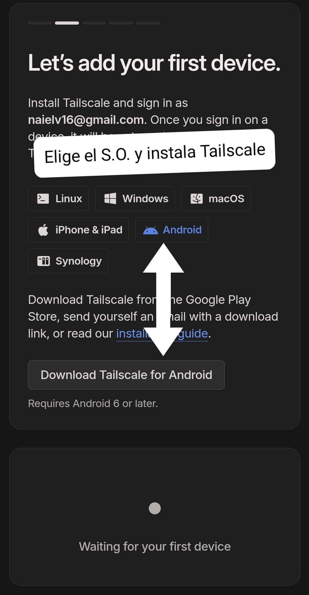

# Bloquear anuncios creando una VPN sin servidor.
## Pasos a seguir
### Paso 1

### Paso 2

### Paso 3

### Paso 4

### Paso 5

### Paso 6

### Paso 7

### Paso 8

### Paso 9

### Paso 10

### Paso 11

### Paso 12

### Paso 13

